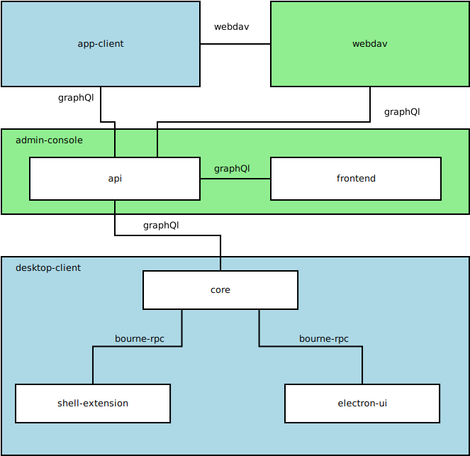

======================
Architectural Overview
======================

Components:

- **app-client**: mobile client app for android and iPhone written in javascript with react-native. (Encryption enabled)
- **webdav**: webdav server using ``jars`` abstraction layer to make storages available to the mobile app. Flask as technology.
- **admin-console**: Used as key-exchange server and to manage users groups and settings. Written in javascript (either in our cloud or at the customers's side)
    - **API**: Uses apollo for graphql
    - **frontend** : react
- **desktop-client**: The desktop client aims to sync files to multiple storages in a fancy manner. (That means it should look nice fore the user and work well.)
    - **core**: Base component responsible to sync and encrypt everything. Uses ``jars`` as abstraction for the access to them. Written in Python.
    - **shell-extension**: Context menu and overlay icons for the operating system's shell. Either C++ for windows or swift on macOS.
    - **electron-ui**: The ui displayed to the user on the desktop. Written with electron and react/javascript inside.

 
Core - Internal communication:

- **SyncEngine**: One SyncEngine runs for each storage provider. It's using ``pykka`` to implement the Actor pattern. It receives events from ``Storage`` (e.g. when things changed on the remote storage) and delegates resulting tasks using a ``TaskQueue``. It stores a tree representing the file structure in the storage (using ``bushn``), each file or directory being a ``Node``. Each ``Node`` has a finite state machine. 
- **SyncFSM**: The finite state machine is assigned to a ``Node``, storing its state and enabling state transitions. It always tries to keep a ``Node`` in the SYNCED state, issuing tasks back to ``SyncEngine`` which in turn forwards them to the ``TaskQueue``
- **StorageProvider (Jars)**: ``jars`` are an abstraction layer around different cloud storage providers (GDrive, OneDrive, ...). They fetch events from the remote storage and forward them to the ``SyncEngine`` (e.g. ``storage_created``, ...). The ``SyncEngine`` then feeds this information into the state machine of the specific file, causing further actions.
- **Bademeister**: The ``bademeister`` manages a pool of worker threads. There is one instance for the whole desktop client. It stores a ``TaskQueue`` containing task objects, for the ``SyncEngine`` to put work (``Task``) in and for ``Workers`` to take tasks out.
- **TaskQueue**: The TaskQueue offers several data structures for other components to distribute tasks and receive back results (so called 'acks').
- **Worker**: A worker runs an infinite loop, waiting for work in form of a ``Task`` to be available in the ``bademeister``'s queue. It then takes a task and runs it, catching all possible exceptions. After execution of the task has finished, it pushes it to the ``ack_queue`` of ``TaskQueue`` which in turn calls ``ack_callback``, returning back to the ``SyncEngine``.
